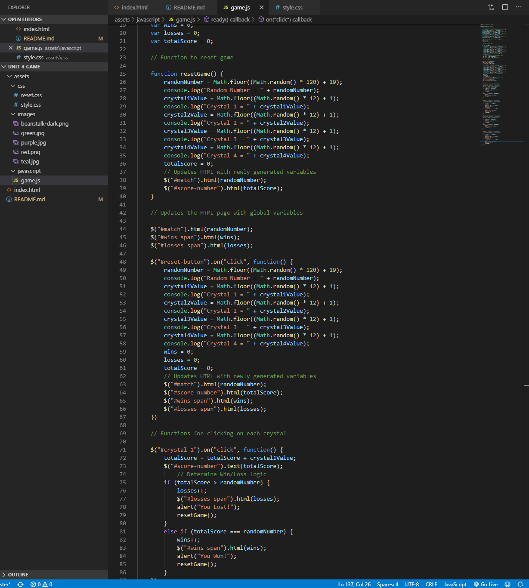

# Crystal Collector!

## About

This application makes use of jquery to create a game in which the user must click on 4 crystals, each with a random value between 1 and 12 assigned to it. The user must continually click on the crystals in an attempt to add up their score and match the random number generated at the top of the screen.

## Demo

Example: [CLICK HERE](https://nicholasherrick.github.io/unit-4-game/.) to view the application

## Build Tools

*HTML

*CSS

*Javascript

*Jquery